<h1 align="center">
  
  <br>
Fashionista - An Ecommerce Application Built Using React, NodeJS, Express & PostgreSQL
</h1>

<p><font size="3">
This is an ecommerce application built using <strong><em>React</em></strong> as the front end, <strong><em>NodeJS</em></strong> and <strong><em>Express</em></strong> as the back end, and <strong><em>PostgreSQL</em></strong> as the database.
<br><br>
Fashionista is a web application where users can shop for products from a variety of categories. Users can filter and sort products by category, price, size, and date. They can also add, remove, and change the product quantity in the cart. Users can place orders with a card, or by using the pay at delivery option. Users can also see their past orders, view profile information, and add or remove addresses from the dashboard section.
<br><br>
<strong><em>Take a look at the live version here:</em></strong> https://fashionista-ecom.herokuapp.com/
</p>

## Table of Contents

- [Project Walk-Through](#project-walk-through)
  - [Home Page](#home-page)
  - [Sign-up Page](#sign-up-page)
  - [Sign-in Page](#sign-in-page)
  - [Products Page](#products-page)
  - [Product Page](#product-page)
  - [Cart Page](#cart-page)
  - [Checkout](#checkout)
    - [Address Page](#address-page)
    - [Payment Page](#payment-page)
    - [Order Success Page](#order-success-page)
  - [Dashboard Page](#dashboard-page)
  - [Orders Page](#orders-page)
  - [Profile Page](#profile-page)
  - [Address Page](#address-page)
- [Live Demo](#live-demo)
- [Technologies Used](#technologies-used)
- [Development Workflow](#development-workflow)
- [Deploying To Heroku](#deploying-to-heroku)
- [Author](#author)
- [Helpful Resources](#helpful-resources)
- [License](#license)

# Project Walk-Through

# Home Page

<div align="center"><a name="menu"></a>

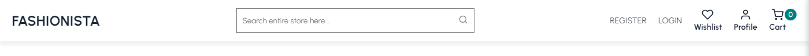

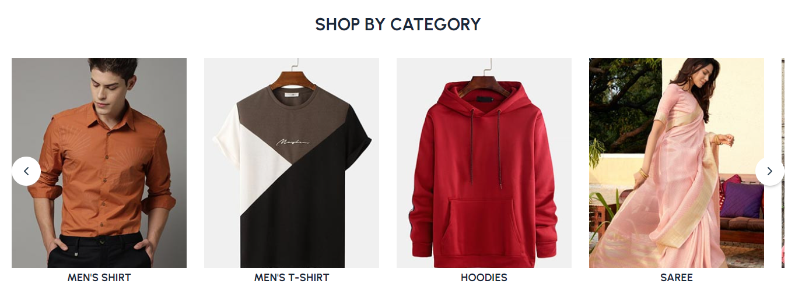

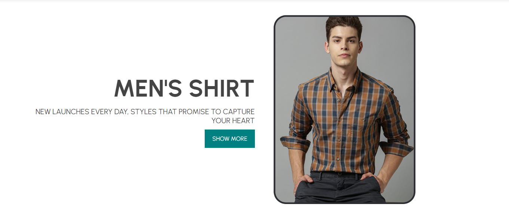
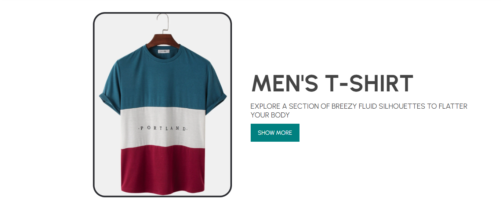
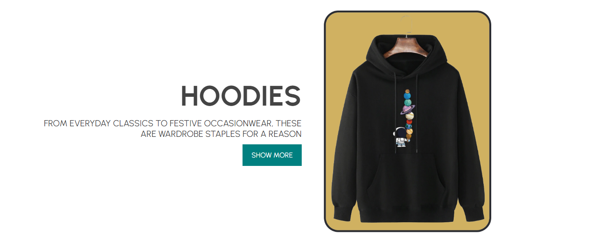


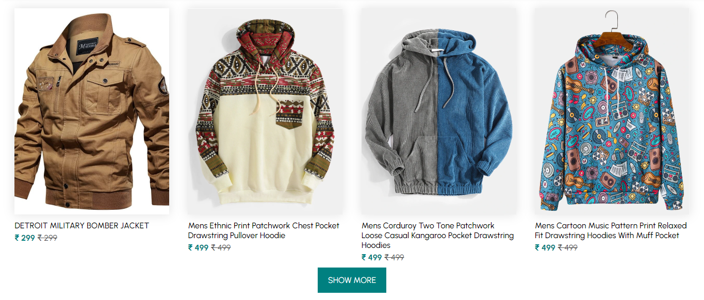

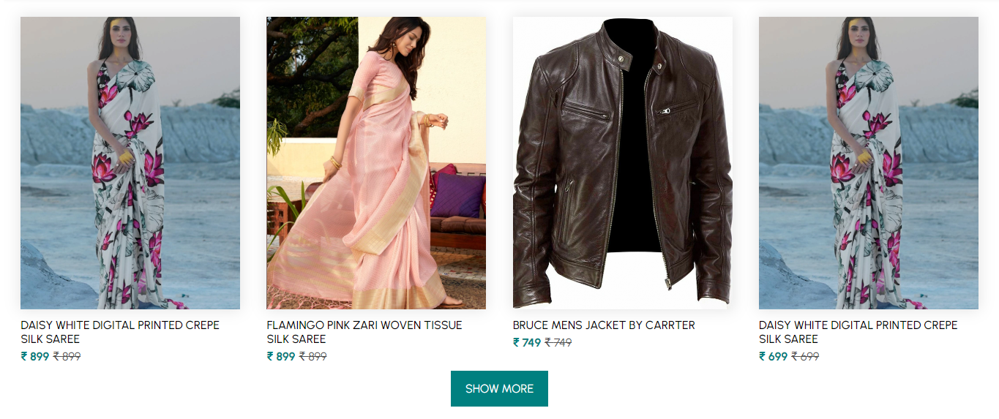

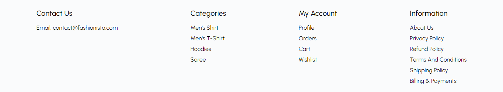

</div>

The Home Page consists of 7 main sections:

**_1)Header, which includes:_**

- Logo: It redirects the user to the home page when clicked on.
- Register Button: It redirects the user to the sign-up page.
- Login Button: It redirects the user to the sign-in page.
- Profile Button: It redirects the user to the dashboard if logged in.
- Cart Button: It redirects the user to the cart if logged in.

**_2)Slider Component:_**

This component displays a slideshow of banner images. It can contain an unlimited number of images. It includes:

- Left Arrow Button: It moves the slider to the previous slide.
- Image: It shows the currently visible image
- Right Arrow Button: It moves the slider to the next slide.
- Slide Indicator Buttons: This component shows which slide is currently active and is used to move the slider to the desired slide directly without having to go through all the slides.

**_3)Categories Carousel Component:_**

This component displays and cycles through multiple images / elements at once. It includes:

- Left Arrow Button: It moves the carousel to the previous position.
- Categories: It shows the currently visible categories.
- Right Arrow Button: It moves the carousel to the next position.

**_4)Popular Categories Component:_**

This component displays the most popular categories on the website. It uses `framer motion` to animate the component when it comes into view. It includes:

- Category Name
- Category Image
- _Show More button:_ It redirects to the page where all the products related to that category all shown.

**_5)New Arrivals Component_**

This component displays the latest products that are added to the website. It includes:

- Product Component: It shows the product image, title, and price. It also shows the "Add to Cart" button on hover.
- _Show More button:_ it redirects to the page where all the products are sorted by the date at which they were added.

**_6)Best Seller Component_**

This component displays the most liked products by the users. It includes:

- Product Component: It shows the product image, title, and price. It also shows the "Add to Cart" button on hover.
- _Show More button:_ it redirects to the page where all the products are sorted by their sales.

**_7)Footer Component_**

This component displays important links and information the users may need.

# Sign-up Page

<div align="center"><a name="menu"></a>


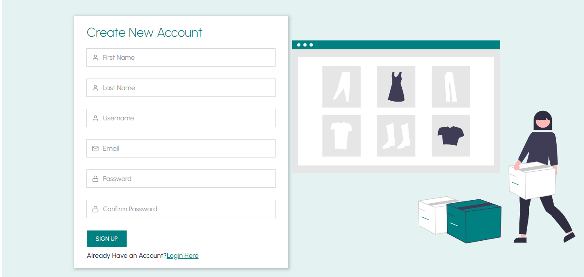


</div>

The Sign-up Page consists of 3 main sections:

**_1)Header, which includes:_**

- Logo: It redirects the user to the home page when clicked on.
- Register Button: It redirects the user to the sign-up page.
- Login Button: It redirects the user to the sign-in page.
- Profile Button: It redirects the user to the dashboard if logged in.
- Cart Button: It redirects the user to the cart if logged in.

**_2)Sign-up Form, which includes:_**

- First Name input field.
- Last Name input field.
- Username input field.
- Email input field.
- Password input field.
- Confirm Password input field.
- "Sign up" button, which submits the form.
- Link to the Sign-in page.

**All of the input fields are validated on the client side as well as on the server side.**

**_3)Footer Component_**

This component displays important links and information the users may need.

# Sign-in Page

<div align="center"><a name="menu"></a>


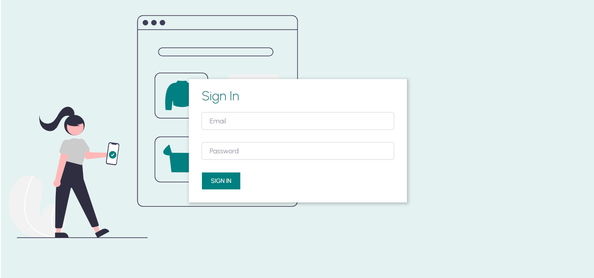


</div>

The Sign-in Page consists of 3 main sections:

**_1)Header, which includes:_**

- Logo: It redirects the user to the home page when clicked on.
- Register Button: It redirects the user to the sign-up page.
- Login Button: It redirects the user to the sign-in page.
- Profile Button: It redirects the user to the dashboard if logged in.
- Cart Button: It redirects the user to the cart if logged in.

**_2)Sign-in Form, which includes:_**

- Email input field.
- Password input field.
- "Sign in" button, which submits the form.
- Link to the Sign-in page.

**All of the input fields are validated on the client side as well as on the server side.**

**_3)Footer Component_**

This component displays important links and information the users may need.

# Products Page

<div align="center"><a name="menu"></a>

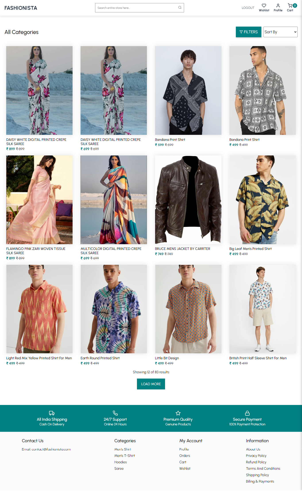

</div>

The Products Page consists of 3 main sections:

**_1)Header, which includes:_**

- Logo: It redirects the user to the home page when clicked on.
- Register Button: It redirects the user to the sign-up page, if not logged in.
- Login Button: It redirects the user to the sign-in page, if not logged in.
- Logout Button: It logs out the user.
- Profile Button: It redirects the user to the dashboard if logged in.
- Cart Button: It redirects the user to the cart if logged in.

**_2)Products Section, which includes:_**

- Product Category: It displays the currently selected product category.
- Filters Button: It opens a side drawer using which the users can filter products based on category, price, and size.
- Sort Button: It sorts the products by price and date at which products were added.
- Product Component: It shows the product image, title, and price. It also shows the "Add to Cart" button on hover.
- Load More Button: It loads more products from the backend.

**_3)Footer Component_**

This component displays important links and information the users may need.

# Product Page

<div align="center"><a name="menu"></a>

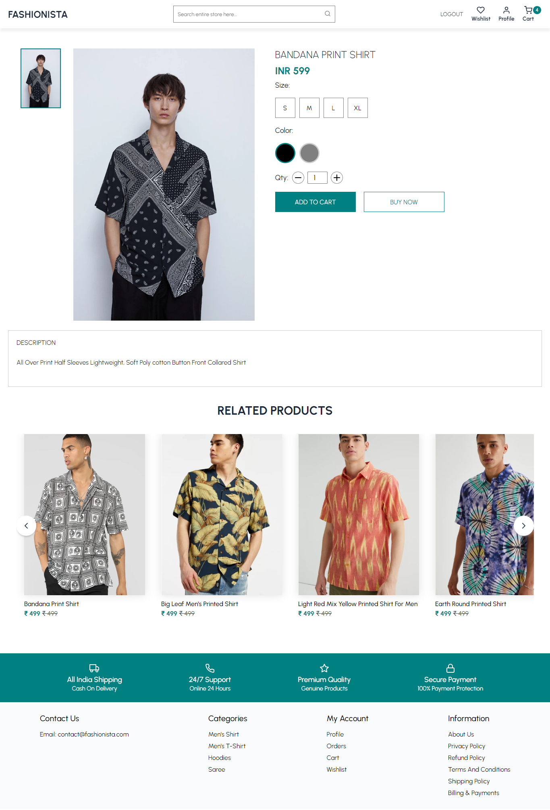

</div>

The Product Page consists of 4 main sections:

**_1)Header, which includes:_**

- Logo: It redirects the user to the home page when clicked on.
- Register Button: It redirects the user to the sign-up page, if not logged in.
- Login Button: It redirects the user to the sign-in page, if not logged in.
- Logout Button: It logs out the user.
- Profile Button: It redirects the user to the dashboard if logged in.
- Cart Button: It redirects the user to the cart if logged in.

**_2)Product Information Section, which includes:_**

- Product Image: It displays the product's image.
- Title: It displays the product's title.
- Size Selector: It displays the sizes the product is available in. It also lets users select a size they want to buy the product in.
- Quantity Input: Users can use this input to add multiple quantities of the product to the cart at once.
- "Add to Cart" Button: This button lets users add products to the cart.

**_3)Related Products Carousel_**

It displays products from the same category as the main product. This component displays and cycles through multiple images/elements at once. It includes:

- Left Arrow Button: It moves the carousel to the previous position.
- Categories: It shows the currently visible categories.
- Right Arrow Button: It moves the carousel to the next position.

**_4)Footer Component_**

This component displays important links and information the users may need.

# Cart Page

<div align="center"><a name="menu"></a>

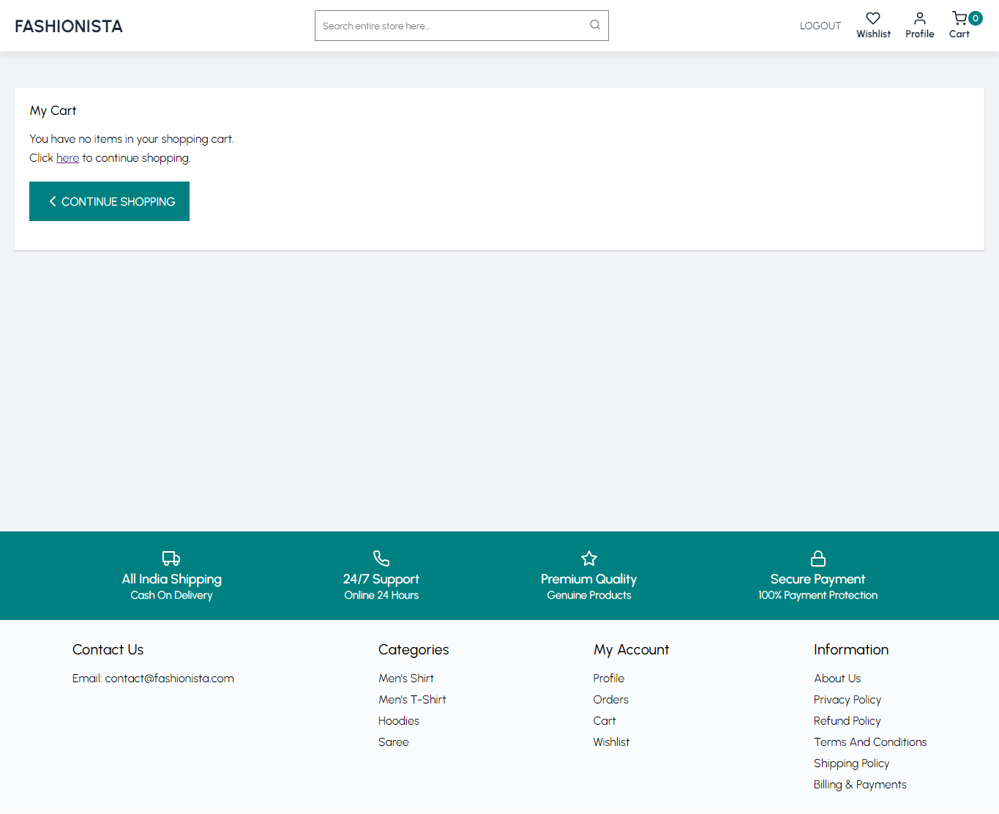
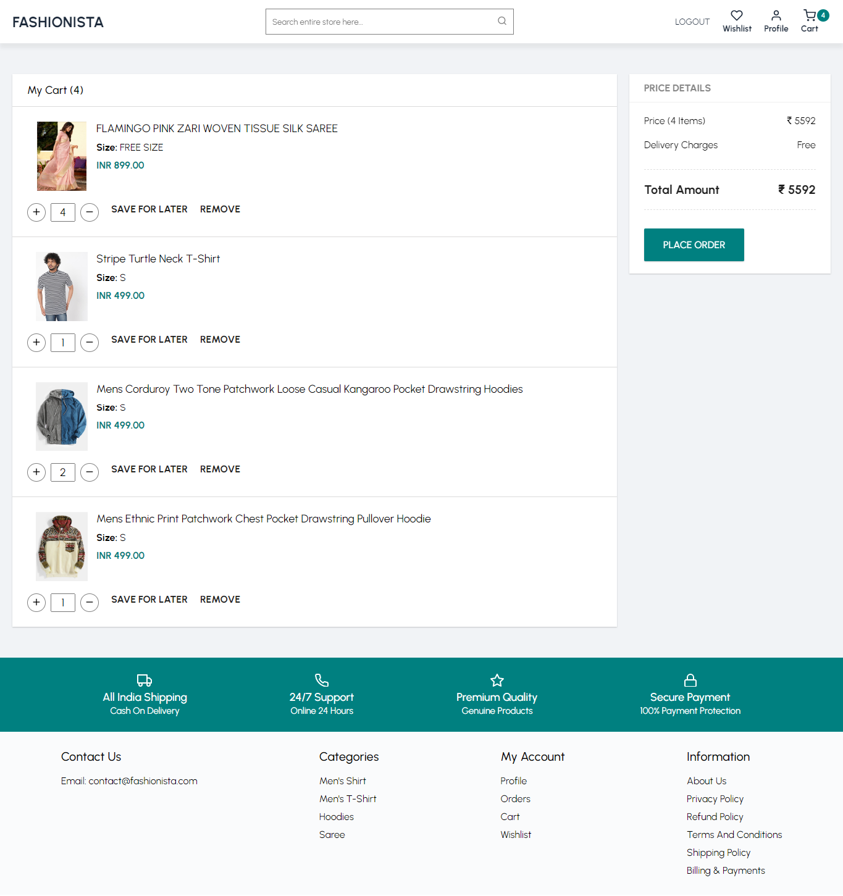

</div>

The Cart Page consists of 4 main sections:

**_1)Header, which includes:_**

- Logo: It redirects the user to the home page when clicked on.
- Register Button: It redirects the user to the sign-up page, if not logged in.
- Login Button: It redirects the user to the sign-in page, if not logged in.
- Logout Button: It logs out the user.
- Profile Button: It redirects the user to the dashboard if logged in.
- Cart Button: It redirects the user to the cart if logged in.

**_2)CartItems Component:_**

This component displays the products that are in the user's cart. For each product, this component displays its title, size, price, and the quantity in the cart. Users can also remove a product from the cart by clicking the “Remove” button, or modify the product quantity using the input field or using the buttons on both sides of the input field.

**_3)Price Detail Component_**

This component is used to display the total price of all the products in the cart, along with the shipping charges. Users can start the checkout process by clicking the “Place Order” button.

**_4)Footer Component_**

This component displays important links and information the users may need.

# Checkout

Checkout consists of 3 pages:

- Address Page
- Payment Page
- Order Success Page

## Address Page

<div align="center"><a name="menu"></a>

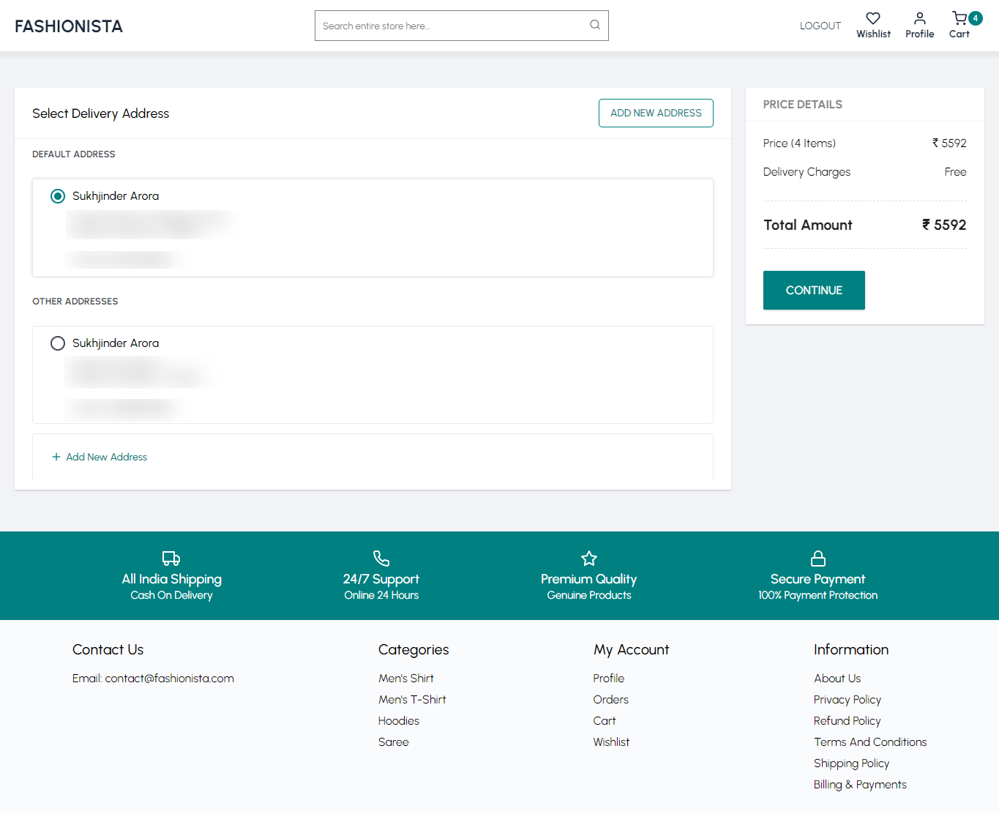

</div>

When a user clicks on the “Place Order” button on the cart page, they are redirected to the Address page to select the shipping address. The Address Page consists of 4 main sections:

**_1)Header, which includes:_**

- Logo: It redirects the user to the home page when clicked on.
- Register Button: It redirects the user to the sign-up page, if not logged in.
- Login Button: It redirects the user to the sign-in page, if not logged in.
- Logout Button: It logs out the user.
- Profile Button: It redirects the user to the dashboard if logged in.
- Cart Button: It redirects the user to the cart if logged in.

**_2)Add New Address Button:_**

This button opens up a pop-up that contains a form to add a new address. Users can use this form to add a new shipping address to their account.

**_3)Address List Component_**

This component is used to display all the addresses saved in the user's account. Users can select any of the saved addresses as the shipping address for the current order.

**_3)Price Detail Component_**

This component is used to display the total price of all the products in the cart, along with the shipping charges. Users can start the checkout process by clicking the “Place Order” button.

**_4)Footer Component_**

This component displays important links and information the users may need.

## Payment Page

<div align="center"><a name="menu"></a>

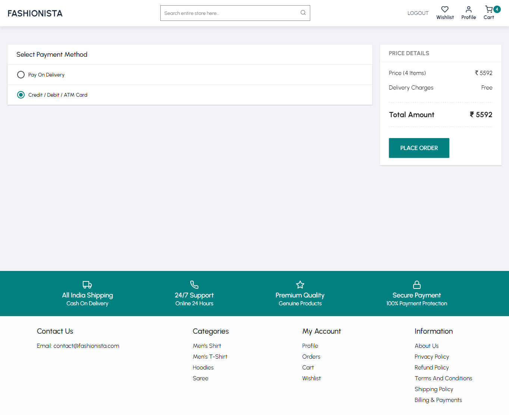
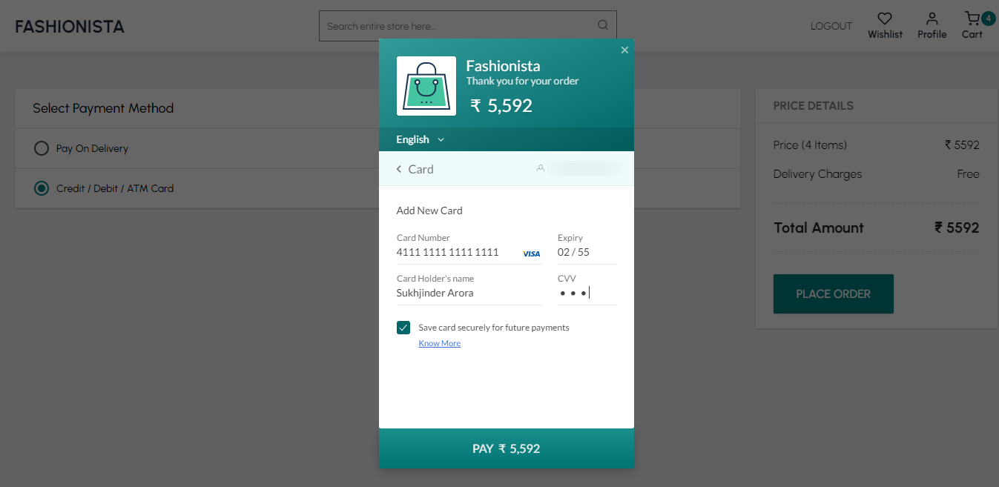

</div>

Users are redirected to the payment page after they have selected the shipping address. The Payment Page consists of 4 main sections:

**_1)Header, which includes:_**

- Logo: It redirects the user to the home page when clicked on.
- Register Button: It redirects the user to the sign-up page, if not logged in.
- Login Button: It redirects the user to the sign-in page, if not logged in.
- Logout Button: It logs out the user.
- Profile Button: It redirects the user to the dashboard if logged in.
- Cart Button: It redirects the user to the cart if logged in.

**_2)Payments Component:_**

This component is used to select a payment method. Users can choose to pay by card or at the time of delivery.

**_3)Price Detail Component_**

This component is used to display the total price of all the products in the cart, along with the shipping charges. Users can place the order by clicking the “Place Order” button. A Razorpay pop-up opens if the user decides to pay by card to complete the payment.

**_4)Footer Component_**

This component displays important links and information the users may need.

## Order Success Page

<div align="center"><a name="menu"></a>

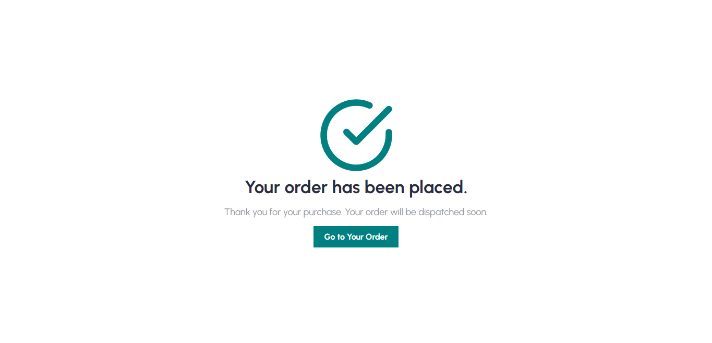

</div>

The Order success Page consists of 2 components:

**_1)Order Success Message:_**

This component displays a success message when a order is successful.

**_2)"Go To Your Order" Button:_**

This button redirects users to the order detail page.

# Dashboard Page

<div align="center"><a name="menu"></a>

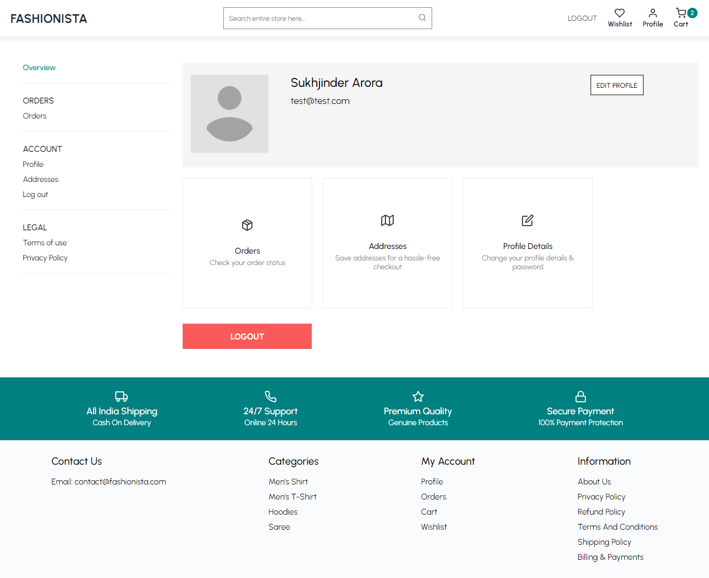

</div>

The Dashboard Page consists of 4 main sections:

**_1)Header, which includes:_**

- Logo: It redirects the user to the home page when clicked on.
- Register Button: It redirects the user to the sign-up page, if not logged in.
- Login Button: It redirects the user to the sign-in page, if not logged in.
- Logout Button: It logs out the user.
- Profile Button: It redirects the user to the dashboard if logged in.
- Cart Button: It redirects the user to the cart if logged in.

**_2)Side Bar Component_**

It contains links to pages like Orders, Profile, and Address. It also contains a button to log out the user.

**_3)Main Content Component_**

This component displays the user's avatar, their name and email. It also contains links to pages like Orders, Profile, and Address. It also contain a button to log out the user.

**_4)Footer Component_**

This component displays important links and information the users may need.

# Orders Page

<div align="center"><a name="menu"></a>

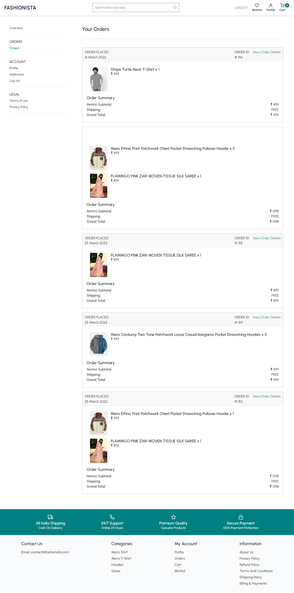

</div>

The Orders Page consists of 4 main sections:

**_1)Header, which includes:_**

- Logo: It redirects the user to the home page when clicked on.
- Register Button: It redirects the user to the sign-up page, if not logged in.
- Login Button: It redirects the user to the sign-in page, if not logged in.
- Logout Button: It logs out the user.
- Profile Button: It redirects the user to the dashboard if logged in.
- Cart Button: It redirects the user to the cart if logged in.

**_2)Side Bar Component_**

It contains links to pages like Orders, Profile, and Address. It also contain a button to log out the user.

**_3)Orders List Component_**

This component displays all the user's orders in reverse chronological order. For each order, it displays the order date, order ID, order total along with product title and product quantity in the order.

**_4)Footer Component_**

This component displays important links and information the users may need.

# Profile Page

<div align="center"><a name="menu"></a>

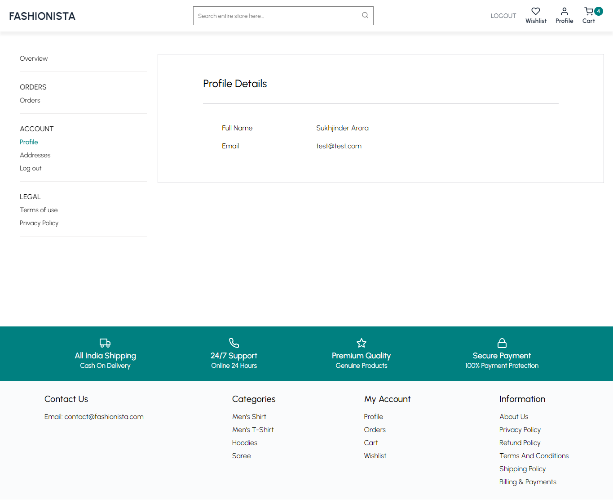

</div>

The Orders Page consists of 4 main sections:

**_1)Header, which includes:_**

- Logo: It redirects the user to the home page when clicked on.
- Register Button: It redirects the user to the sign-up page, if not logged in.
- Login Button: It redirects the user to the sign-in page, if not logged in.
- Logout Button: It logs out the user.
- Profile Button: It redirects the user to the dashboard if logged in.
- Cart Button: It redirects the user to the cart if logged in.

**_2)Side Bar Component_**

It contains links to pages like Orders, Profile, and Address. It also contain a button to log out the user.

**_3)Profile Details Component_**

This component displays user's full name and email.

**_4)Footer Component_**

This component displays important links and information the users may need.

# Address Page

<div align="center"><a name="menu"></a>

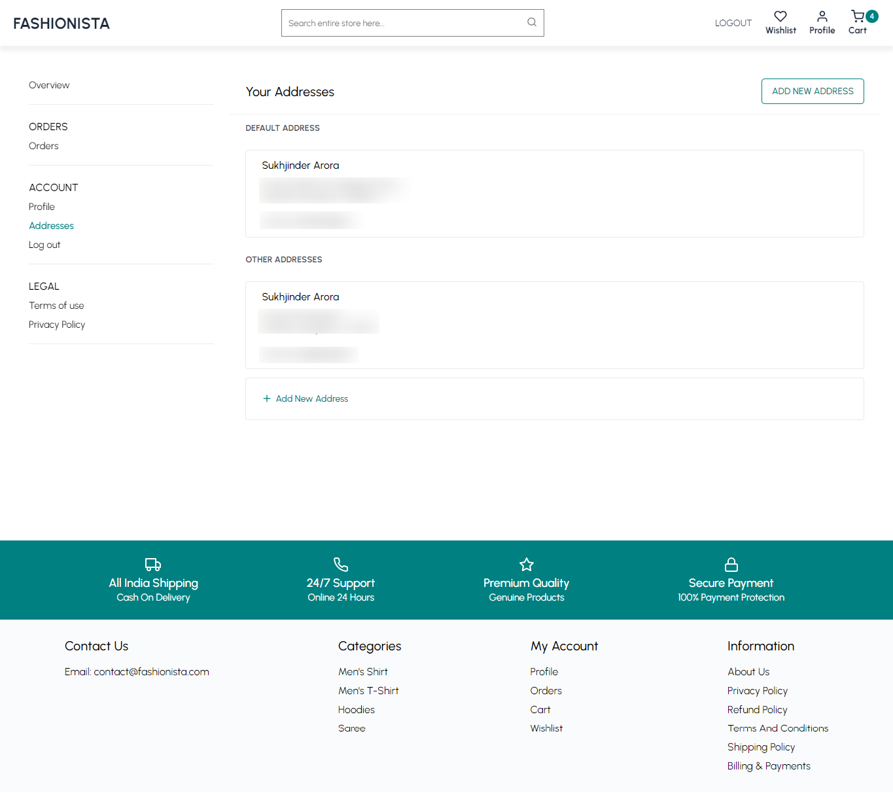
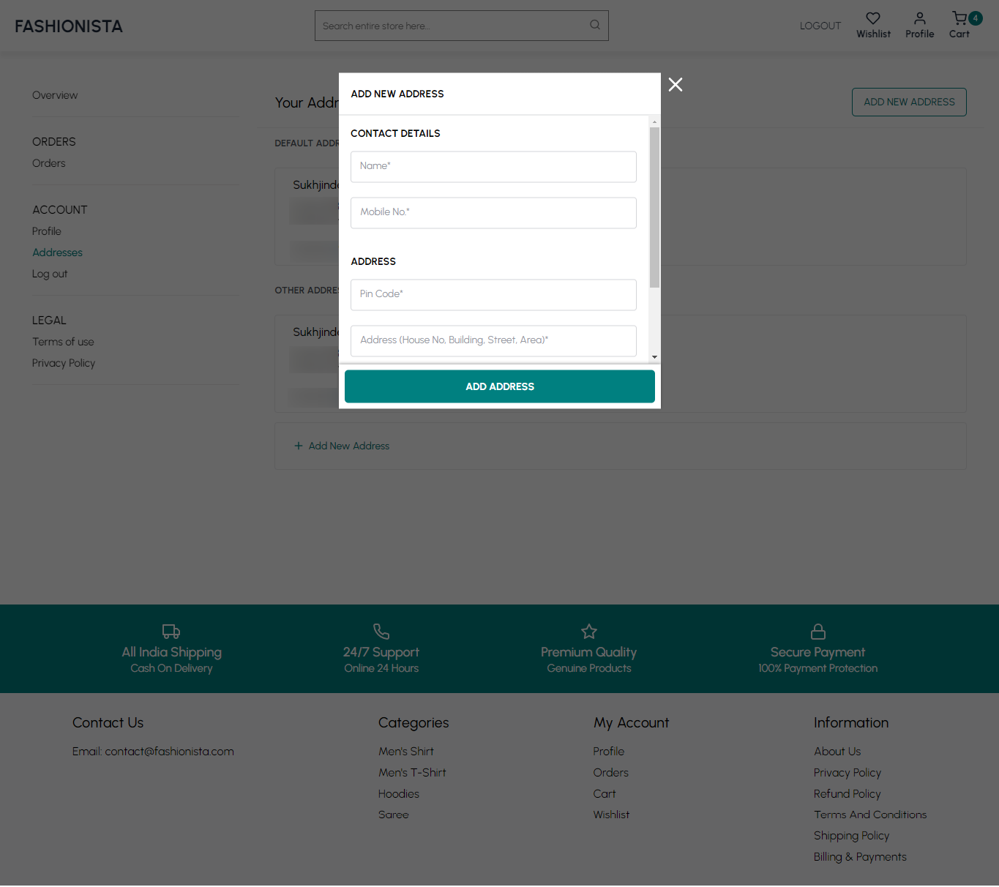

</div>

The Address Page consists of 4 main sections:

**_1)Header, which includes:_**

- Logo: It redirects the user to the home page when clicked on.
- Register Button: It redirects the user to the sign-up page, if not logged in.
- Login Button: It redirects the user to the sign-in page, if not logged in.
- Logout Button: It logs out the user.
- Profile Button: It redirects the user to the dashboard if logged in.
- Cart Button: It redirects the user to the cart if logged in.

**_2)Side Bar Component_**

It contains links to pages like Orders, Profile, and Address. It also contain a button to log out the user.

**_2)Add New Address Button:_**

This button opens up a pop-up that contains a form to add a new address. Users can use this form to add a new shipping address to their account.

**_3)Address List Component_**

This component is used to display all the addresses saved in the user's account. Users can select any of the saved addresses as the shipping address for the current order.

**_4)Footer Component_**

This component displays important links and information the users may need.

# Live Demo

**_Take a look on the live version here:_** https://fashionista-ecom.herokuapp.com/

# Technologies Used

This project is built using:

- ReactJS
- React Hooks
- Custom React Hooks Like `useForm` and `useInView`
- React Router V6
- Redux Toolkit
- Styled Components
- Framer motion
- NodeJS
- Express
- PostgreSQL
- Sequelize
- Heroku

# Development Workflow

### Prerequisites:

To be able to run this application locally on your system, you'll need:

- [Git](https://git-scm.com/downloads) version 2.25 or higher
- [NodeJS](https://nodejs.org/en/download/) version 16.14.2 or higher
- [PostgreSQL](https://www.postgresql.org/download/) version 14.5 or higher

### Steps to run this application locally:

1. Start by cloning the repository into your local file system.

   ```bash
   git clone https://github.com/SukhjinderArora/fullstack-ecommerce-app.git
   ```

2. CD in to the project directory

   ```bash
   cd fullstack-ecommerce-app
   ```

3. Open the repository in your favorite code editor.
4. Go into the `api` directory inside the project directory.
5. Rename the `.env.example` to `.env` and set up all the environment variables mentioned in that file.
6. Now go into the `client` directory inside the project directory.
7. Rename the `.env.example` to `.env` and set up all the environment variables mentioned in that file.
8. Optionally, you can restore the database from the `ecommerce.dump` file in the `database-backup` directory to get the sample list of products and categories loaded in the database. For example:

   ```bash
   pg_restore -d <database-name> ecommerce.dump -h 127.0.0.1 -p 5432 -U <database-user>
   ```

   **Note:** Replace the database-name and database-user with your database name and user.

9. `CD` into the `api` directory of the project and run the following command to start the server:
   ```bash
   npm run dev
   ```
10. `CD` into the `client` directory of the project and run the following command to start the react app:
    ```bash
    npm start
    ```

# Deploying To Heroku

### Prerequisites:

To be able to deploy this app to Heroku, you'll need:

- An [Heroku](https://www.heroku.com/) account
- [Heroku CLI](https://devcenter.heroku.com/articles/heroku-cli) installed on your system

### Steps to deploy this app on Heroku:

1. CD into the project's root directory.
2. Now login to Heroku by running the following command:

   ```bash
   heroku login
   ```

3. `CD` into the project's root directory and run:

   ```bash
   heroku create <application-name>
   ```

4. `CD` into the `client` directory of the project and run the following command to build the react application:

   ```bash
   cd client
   npm run build-and-move
   ```

   This command builds the React application and moves the `build` directory from the `client` directory to the `api` directory and renames it to the `public` directory.

5. Now, `cd` into the project's root directory and run the following command to push the application to the remote Heroku repository:

   ```bash
   git subtree push --prefix api heroku main
   ```

   Because we only want to push the `api` directory to Heroku, this command will generate a new commit tree with the `api` directory as root, and push it to the remote Heroku repository.

6. Provision the PostgreSQL database in your application dashboard on Heroku website.

7. Optionally, you can restore the database from the `ecommerce.dump` file in the `database-backup` directory by running this command:

   ```bash
   heroku pg:backups:restore '<URL of upload location>' DATABASE_URL --app <your-heroku-app-name>
   ```

   **Note:** In order for PG Backups to access and import your dump file you will need to upload it somewhere with an HTTP-accessible URL.

8. Set up the environment variables in your application dashboard on Heroku.
9. You should now be able to access the application at `https://<application-name>.herokuapp.com/` in your browser.

# Author

**Sukhjinder Arora** 👨‍💻

- Github: https://github.com/sukhjinderArora
- LinkedIn: https://linkedin.com/in/sukhjinder-arora
- Website: https://sukhjinderarora.com

# Helpful Resources

- [Backup and restore PostgreSQL database](https://www.postgresql.org/docs/current/backup-dump.html)
- [How to Backup and Restore a PostgreSQL Database](https://www.tecmint.com/backup-and-restore-postgresql-database/)
- [Integrate Razorpay Payment Gateway in your React app](https://dev.to/soumyadey/integrate-razorpay-in-your-react-app-2nib)
- [Importing and Exporting Heroku Postgres Databases](https://devcenter.heroku.com/articles/heroku-postgres-import-export)
- [Deploying Node.js Apps on Heroku](https://devcenter.heroku.com/articles/deploying-nodejs)

# License

MIT License
